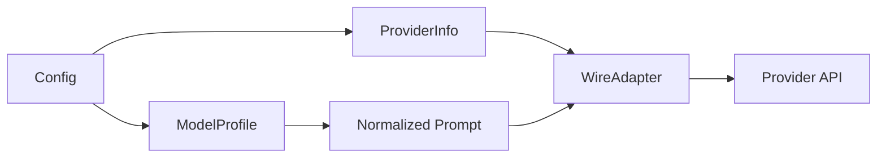

# Architecture

This file captures the durable architecture view for the repo. The codebase is a brownfield Rust/Node.js monorepo, so the goal here is to explain the stable boundaries rather than redesign them.

## System Shape

- Kay's Rust workspace and CLI binaries live under the current `code-rs/` workspace root
- Root-level docs explain user-facing behavior and workflow guidance
- GSD and Silver Bullet metadata live outside the product code, under `.planning/` and `~/.claude/.silver-bullet/`
- Built-in model providers include `opencode-go`; matching provider-local model slugs are normalized on the Responses/compact wire paths before request dispatch

## Data Flow

1. User-facing commands enter through the CLI entrypoints
2. Project workflow decisions are captured in `.planning/`
3. Docs and workflow scaffolding document the stable operating model
4. Model/provider compatibility flows through config loading, provider registration, and resume replay, with outbound model slugs normalized only where the target wire format expects provider-local names

## Provider-Model Abstractions

### Assessment

- The current split is solid: `ModelProviderInfo` owns transport, auth, base URL, and wire API choice, while `ModelFamily` owns capability and compatibility policy.
- That was enough to add OpenCode Go and MiniMax without disturbing the OpenAI default path or the CLI surface.
- The architecture is still pragmatic rather than fully plugin-shaped:
  - `find_family_for_model()` is still a prefix-and-exception chain.
  - `build_chat_completions_payload()` still mixes normalization, role shaping, reasoning replay, and provider-specific formatting.
  - `ModelFamily` now carries both capabilities and adaptation policy, which is useful but getting dense.

### Next Iteration Sketch

- Keep `ProviderInfo` thin: auth, endpoint, headers, wire API, and retry policy.
- Move model-specific behavior into `ModelProfile`: slug matching, default reasoning settings, role normalization, reasoning replay, and tool/rendering quirks.
- Make wire translation a small adapter layer, such as `ChatCompletionsAdapter` and `ResponsesAdapter`.
- Prefer registry data over growing `if/else` ladders so new provider and model plugins can be additive and orthogonal.

## Current Notes

- Build validation is centered on `./build-fast.sh`
- Existing repo docs are preserved during init rather than being replaced
- Phase 1 planning stays foundation-only: interface seams first, docs/live/release work deferred to later phases
- `opencode-go` is now reserved as a built-in provider id, so custom configs should avoid reusing that key
- Future architecture notes should continue to be appended here when a real subsystem boundary changes
